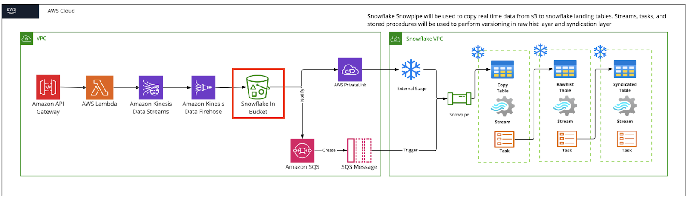

# 🚀 Real-Time Streaming Data Pipeline

This project showcases a real-time data ingestion pipeline using **AWS** and **Snowflake**, simulating production-grade streaming from an external API into a cloud data warehouse.

---

## 🔧 Tech Stack

- **API Gateway** – Receives real-time JSON events  
- **AWS Lambda** – Parses, enriches, and routes data  
- **Amazon Kinesis Firehose** – Streams data to S3  
- **Amazon S3** – Acts as the landing zone for Snowflake ingestion  
- **Snowflake + Snowpipe** – Automatically ingests files into Snowflake tables  

---

## 🧩 Architecture Overview

1. **API Gateway**: Accepts POST requests from external sources
2. **Lambda Function**: Validates and enriches data; routes valid events to Firehose and errors to a separate S3 bucket
3. **Kinesis Firehose**: Buffers and delivers records to S3
4. **S3 Bucket**: Stores JSON files for downstream processing
5. **Snowpipe**: Automatically loads files from S3 into a Snowflake staging table for querying

---

## Tech Stack
- AWS Lambda
- API Gateway
- Kinesis Firehose
- AWS S3
- Snowflake + Snowpipe

## 📂 Repository Structure
/diagrams/ → Flow Diagrams
/lambda/ → Lambda function source code
/snowflake/ → Snowflake schema, stage, and pipe scripts
/iam/ → AWS IAM roles
/tests/ → Sample JSON data for validation
README.md → This documentation file

---

## ✅ Highlights

- Serverless and scalable design
- Near real-time data visibility
- Minimal maintenance using managed services

---

## 🏷️ Tags & Topics

Use these hashtags when sharing the project:
#DataEngineering #AWS #Snowflake #RealTimeData #StreamingData #Serverless #ETL #DataPipeline #Kinesis #CloudComputing #Lambda
